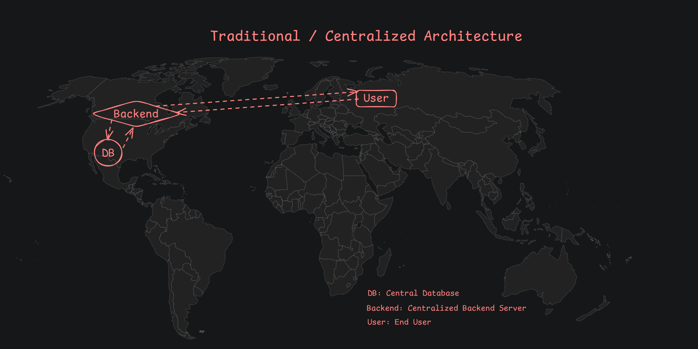
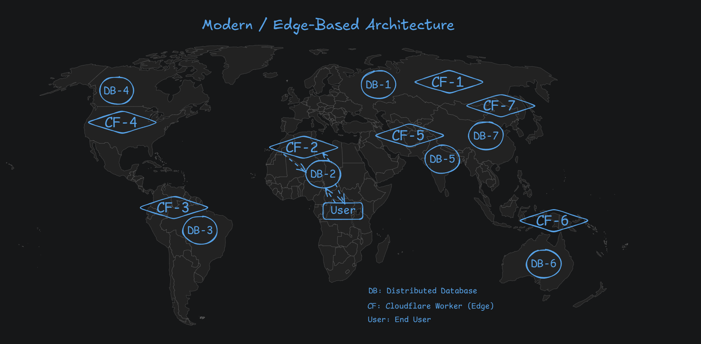

# 🌍 High-Performance Edge-Based API with Next.js, Hono, Redis & Cloudflare: `⚡ Speed Search`
This project demonstrates how to build a **globally distributed, high-performance API** using a modern edge-first architecture. By combining **Next.js**, **Hono**, **Redis**, and **Cloudflare Workers**, this stack delivers ultra-low latency, high scalability, and a great developer experience (DX).

> 🔎 **Speed Search** allows users to search for countries and compare performance between **PostgreSQL** and **Redis** search engines — showcasing real-world speed benefits of distributed edge architecture.

---

## 🖼️ Architecture Comparison
### 🧱 Traditional / Centralized Architecture


> All requests are routed to a centralized backend and database, often located in a single region (e.g., US). This setup introduces high latency and poor performance for users across the globe.

* **Backend**: Monolithic or region-specific API logic
* **DB**: Centralized data store (e.g., SQL/Redis in a single region)
* **Problem**: Long round-trips for distant users

---

### ⚡ Modern / Edge-Based Architecture


> In this architecture, user requests are handled by the **nearest Cloudflare Worker**, which communicates with a **globally distributed Redis database**. The result: **faster response times** and **scalable performance** across continents.

* **CF**: Cloudflare Workers (Edge Functions)
* **DB**: Globally distributed Redis (e.g., Upstash Redis)
* **Benefit**: Reduced latency, auto-scaling, and regional proximity

---

## 🚀 Use Case: Speed Search Demo
With Speed Search, users can:
* 🔍 **Search for countries** in real-time as they type
* 🛠 **Choose between Redis or PostgreSQL** as the underlying search engine
* ⚡ **View real-time speed comparison** for each query

This highlights the **performance tradeoffs between a traditional relational database (PostgreSQL)** and a **high-speed in-memory store (Redis)** — both accessed through an edge-deployed API.

---

### 🔤 How Redis Enables Lightning-Fast Search
This project uses a **prefix-based autocomplete algorithm** inspired by [Redis creator Salvatore Sanfilippo (antirez)](https://antirez.com). It allows **instant country name suggestions** as the user types.

#### 🧠 How It Works:
For a country like `"INDIA"`, we generate and store all its leading substrings in uppercase:
```
I
IN
IND
INDI
INDIA*
```

* All entries are stored in **uppercase** for case-insensitive matching.
* The full word is stored with a trailing `*` to indicate a **complete suggestion**.
* When a user types `"ind"`, Redis can instantly return matching suggestions like `"INDIA*"`, `"INDIA"`.

#### ⚡ Why This Is Fast:
* Redis handles prefix queries extremely fast due to its **in-memory structure**.
* Cloudflare Workers reduce latency by hitting the **nearest Redis edge** (via Upstash).
* No SQL parsing, full scans, or joins — just blazing fast key lookups.

This architecture allows **instantaneous, sub-ms suggestions**, unlike traditional database-backed search.

---

### 🌟 Key Features
* ⚡ **Blazing Fast**: Built with Hono (ultrafast edge framework) and Redis (sub-ms reads/writes)
* 🌐 **Edge-Native**: Serverless deployment with Cloudflare Workers for global reach
* 🧠 **Modern Stack**: Uses Next.js for frontend, API routes, or server components
* 📈 **Scalable by Design**: Horizontally scalable, with distributed compute and storage
* 🧲 **Optimized Data**: Redis as both cache and primary data layer (via Upstash)
* 🔎 **Engine Selector**: Compare Redis vs PostgreSQL search speed

---

### 🛠 Technologies Used
| Tech                   | Purpose                                 |
| ---------------------- | --------------------------------------- |
| **Next.js**            | UI and frontend logic                   |
| **Hono**               | Edge API framework (Cloudflare Workers) |
| **Redis (Upstash)**    | Global, low-latency key-value store     |
| **PostgreSQL**         | Relational database (for comparison)    |
| **Cloudflare Workers** | Edge execution of API logic             |

---

### 🧪 Getting Started
To run this project locally or deploy it, follow these steps:
#### 1. 📁 Setup Environment Variables
* Copy the `.env.sample` file and rename it to `.env`
* Fill in the required environment values

#### 2. ⚙️ Configure Cloudflare Wrangler
* Copy `wrangler.sample.toml` and rename it to `wrangler.toml`
* Update the config with your environment settings

#### 3. 🌱 Seed the Databases
Run the following commands to seed both Redis and PostgreSQL with country data:
```bash
npm run redis:seed && npm run postgres:seed
```

#### 4. 🚀 Deploy the Cloudflare Worker
Deploy your edge backend using Wrangler:
```bash
npm run deploy:cf
```
* After deployment, copy the Cloudflare Worker URL
* In production: paste the deployed URL into your `.env` as the backend API endpoint
* In development: you can point to your local backend if desired

---
